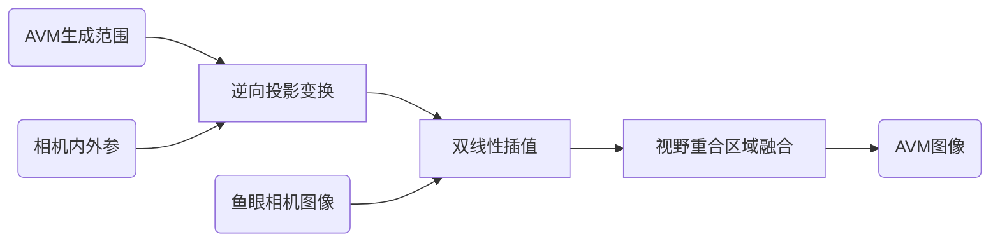
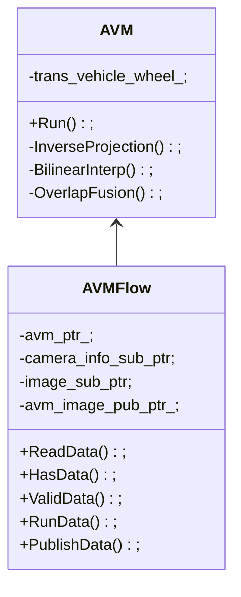

<!--面向辅助驾驶应用的鱼眼相机环视拼接方案-->

<!--
## 1.环视图像拼接(AVM)意义及目标

在自动驾驶或者自主泊车系统中，环视全景图像拼接可以消除车辆周围的视觉盲点，帮助驾驶员更加直观地确认周围路况。在本项目中，需要在环视全景图像中完成地面标线的语义分割，用于后续建图和定位。本方案基于车体四周安装的四个180&deg;鱼眼相机，完成环视图像拼接。
-->
## 1. Background

In autonomous driving or autonomous parking systems, surround view panorama image stitching eliminates visual blind spots around the vehicle, helping drivers intuitively assess surrounding road conditions. In this project, semantic segmentation of ground markings needs to be performed on surround view panoramic images for subsequent mapping and localization. This solution is based on four 180&deg; fisheye cameras installed around the vehicle.

<!--
## 2.AVM算法原理

### 2.0 鱼眼图像校正

根据鱼眼相机内参标定结果，对鱼眼相机图像进行校正，如图2.1.1所示。
-->
## 2. AVM Algorithm

### 2.0 Fisheye Image Correction

Based on the intrinsic calibration of fisheye cameras, fisheye camera images are corrected as shown in Figure 2.1.1.


<!--图2.1.1 鱼眼图像校正: (左)校正前 (右)校正后-->
Figure 2.1.1 Fisheye Image Correction: (Left) Before correction, (Right) After correction

<!--
### 2.1 俯视变换

经过相机-车体外参标定，可以得到右、前、左、后四个环视相机的相对于车体后轮中心的位姿分别为\\(T_{wc_1}\\)、\\(T_{wc_2}\\)、\\(T_{wc_3}\\)和\\(T_{wc_4}\\)。已知IMU安装在车体后轴中心，假设车体后轮间距为$d$，后轴高度为$h$，则可知车体左后轮坐标系到IMU坐标系(即为车体坐标系)的变换为
-->
### 2.1 Top-Down Transformation

After camera-vehicle extrinsic calibration, the poses of the four surround-view cameras relative to the vehicle's rear wheel center are obtained as \\(T_{wc_1}\\), \\(T_{wc_2}\\), \\(T_{wc_3}\\), and \\(T_{wc_4}\\). Given that the IMU is mounted at the vehicle's rear axle center and assuming a rear axle spacing of \\(d\\) and axle height \\(h\\), the transformation from the vehicle's left rear wheel coordinate system to the IMU coordinate system (i.e., vehicle coordinate system) is

$$
T_{vw}=
\begin{bmatrix}
1 & 0 & 0 & 0 \\
0 & 1 & 0 & d/2 \\
0 & 0 & 1 & -h \\
0 & 0 & 0 & 1
\end{bmatrix}
$$

<!--假设地面上一点\\(p\\)在车体坐标系下的坐标为\\(p_{v}\\)，对应齐次坐标为\\(\tilde{p}_v\\)，以右视相机为例，该点在相机坐标系下的齐次坐标可以计算为-->
Assuming a point \\(p\\) on the ground with coordinates \\(p_{v}\\) in the vehicle coordinate system, corresponding to homogeneous coordinates \\(\tilde{p}_v\\), taking the right-side camera as an example, the homogeneous coordinates of this point in the camera coordinate system can be calculated as

$$
\tilde{p}_{c1}=T_{wc_1}^{-1}T_{vw}^{-1}\tilde{p}_v
$$

<!--通过相机内参标定获得的相机内参矩阵\\(K\\)和畸变模型参数\\(D\\)，根据鱼眼相机模型，可以得到\\(p_{c1}\\)对应鱼眼图像的像素坐标\\((u_{c1},v_{c1})^T\\)。-->
Using the camera intrinsic calibration matrix \\(K\\) and distortion model parameters \\(D\\) obtained through calibration, based on the fisheye camera model, \\(p_{c1}\\) corresponds to the fisheye image pixel coordinates \\((u_{c1},v_{c1})^T\\).


<!-- ### 2.2 环视图像生成

车体周围生成环视图像的区域大小为\\(L\times L\\)，将此区域栅格化成为\\(N\times N\\)的单元格，每一个单元格对应环视图像的一个像素，则每个像素的物理尺寸为\\({L}/{N}\\)。假设车体坐标系原点在地面上的垂直投影点对应的环视图像像素坐标为\\((c_x,c_y)^T\\)，则对于任一像素点\\((u,v)^T\\)，其对应地面点在车体坐标系下的3D坐标\\(p_v\\)为 -->

### 2.2 Surround View Image Generation

The region for generating surround view images around the vehicle is \\(L\times L\\). This region is rasterized into \\(N\times N\\) cells, where each cell corresponds to a pixel in the surround view image. Thus, the physical size of each pixel is \\({L}/{N}\\). Assuming the projection of the vehicle coordinate system origin's vertical projection point on the ground corresponds to the surround view image pixel coordinates \\((c_x,c_y)^T\\), for any pixel point \((u,v)^T\\), the corresponding 3D coordinates \\(p_v\\) in the vehicle coordinate system are

$$
p_v=
\begin{bmatrix}
(c_x-u)\frac{L}{N} \\
(c_y-v)\frac{L}{N} \\
-h
\end{bmatrix}
$$

<!-- 根据2.2节内容，可以直接得到$p_v$对应的图像平面像素坐标\\((u_{c},v_{c})^T\\)，对该像素坐标分别进行上下取整，可以得到四个离散坐标值，分别记为\\((u_{c\_floor},v_{c\_floor})^T\\)、\\((u_{c\_floor},v_{c\_ceil})^T\\)、\\((u_{c\_ceil},v_{c\_floor})^T\\)和\\((u_{c\_ceil},v_{c\_ceil})^T\\)，进行双线性插值可得 -->
According to Section 2.2, the pixel coordinates \\((u_{c},v_{c})^T\\) corresponding to \\( p_v \\) on the image plane can be directly obtained. By rounding these pixel coordinates up and down, four discrete coordinate values can be obtained, denoted as \\((u_{c\_floor},v_{c\_floor})^T\\), \\((u_{c\_floor},v_{c\_ceil})^T\\), \\((u_{c\_ceil},v_{c\_floor})^T\\) and \\((u_{c\_ceil},v_{c\_ceil})^T\\). Bilinear interpolation can then be applied to obtain

$$
f(u_c,v_{c\_floor})=
\frac{u_{c\_ceil}-u_c}{u_{c\_ceil}-u_{c\_floor}}
f(u_{c\_floor},v_{c\_floor})
+\frac{u_c-u_{c\_floor}}{u_{c\_ceil}-u_{c\_floor}}
f(u_{c\_ceil},v_{c\_floor}) 
$$

$$
f(u_c,v_{c\_ceil})=
\frac{u_{c\_ceil}-u_c}{u_{c\_ceil}-u_{c\_floor}}
f(u_{c\_floor},v_{c\_ceil})
+\frac{u_c-u_{c\_floor}}{u_{c\_ceil}-u_{c\_floor}}
f(u_{c\_ceil},v_{c\_ceil}) 
$$

$$
f(u_c,v_c)=
\frac{v_{c\_ceil}-v_c}{v_{c\_ceil}-v_{c\_floor}}
f(u_{c},v_{c\_floor})
+\frac{v_c-v_{c\_floor}}{v_{c\_ceil}-v_{c\_floor}}
f(u_{c},v_{c\_ceil}) 
$$

<!-- 其中，\\(f(u_c,v_c)\\)表示像素坐标\\((u_{c},v_{c})^T\\)处的图像颜色值。至此得到环视图像\\((u,v)^T\\)坐标处的颜色值，即完成环视图像的生成。 -->
Here, \\(f(u_c,v_c)\\) represents the image color value at pixel coordinates \\((u_{c},v_{c})^T\\). Thus, the color value at the coordinates \\((u,v)^T\\) of the surround view image is obtained, completing the generation of the surround view image.

$$
f_{AVM}(u,v)=f(u_c,v_c)
$$


<!-- ### 2.3 视野重叠区域处理

对于安装在车体四周的180&deg;鱼眼相机，两两之间存在视野重叠区域，如图2.3.1所示，I、III、VI和VIII四个区域内的点，可能同时被相邻的两个相机观测到，对于这些点，需要进行额外的融合处理。 -->

### 2.3 Handling Overlapping Regions

For the 180&deg; fisheye cameras installed around the vehicle, there are overlapping regions between each pair, as illustrated in Figure 2.3.1. Points within regions I, III, VI, and VIII may be observed by adjacent cameras simultaneously, necessitating additional fusion processing for these points.


<!-- 图2.3.1 车体四周区域划分 -->
Figure 2.3.1 Vehicle Surrounding Region Division

<!-- 不失一般性，以区域III为例，假设其中一点\\((u,v)^T\\)可以被右视相机和前视相机同时观测到，其对应右视相机和前视相机图像上的像素坐标分别为\\((u_{c1},v_{c1})^T\\)和\\((u_{c2},v_{c2})^T\\)。另外，假设右视和前视相机图像平面中心点分别为\\((c_{x1},c_{y1})^T\\)和\\((c_{x2},c_{y2})^T\\)，令 -->
Without loss of generality, considering region III as an example, suppose a point \\((u,v)^T\\) can be observed by both the right-view and front-view cameras. Its corresponding pixel coordinates on the right-view and front-view camera images are \\((u_{c1},v_{c1})^T\\) and \\((u_{c2},v_{c2})^T\\), respectively. Additionally, assume the centers of the right-view and front-view camera image planes are \\((c_{x1},c_{y1})^T\\) and \\((c_{x2},c_{y2})^T\\), respectively. Define

$$
\rho_1=\sqrt{(u_{c1}-c_{x1})^2+(v_{c1}-c_{y1})^2} 
$$

$$
\rho_2=\sqrt{(u_{c2}-c_{x2})^2+(v_{c2}-c_{y2})^2}
$$

<!-- 基于越靠近图像边缘的点，畸变越大的原则，设计视野重叠区域融合方案为 -->
Based on the principle that points closer to the edges of the image exhibit more distortion, a fusion scheme for handling overlapping regions is designed as follows.

$$
f_{AVM}(u,v)=
\frac{1}{\rho_1}f_{c1}(u_{c1},v_{c1})
+\frac{1}{\rho_2}f_{c2}(u_{c2},v_{c2})
$$

<!-- ## 3.AVM系统实现方案

### 3.1 AVM算法流程

图3.1.1为AVM算法总体流程，其输入为鱼眼相机图像、相机内外参以及给定AVM生成范围，输出为AVM环视图像，处理过程主要包含逆向投影变换、双线性插值和视野重合区域融合。 -->

## 3. AVM System Implementation

### 3.1 AVM Algorithm Workflow

Figure 3.1.1 depicts the overall workflow of the AVM (All-round View Monitor) algorithm. It takes fisheye camera images, camera intrinsic and extrinsic parameters, and a specified AVM generation range as inputs, and outputs the AVM panoramic image. The processing includes inverse projection transformation, bilinear interpolation, and merging of overlapping regions.



<!-- 图3.1.1 AVM算法流程 -->
Figure 3.1.1 AVM Algorithm Workflow

<!-- 逆向投影变换主要将AVM环视图像中的各个像素点对应的地面点3D坐标变换到环视相机图像平面坐标系，将得到的像素坐标离散化后可以获取对应的图像颜色值。接着，通过双线性插值算法，计算得到对应AVM图像坐标处的颜色值。最后，对相邻相机的视野重合区域的像素点进行融合，得到AVM图像结果。 -->
The inverse projection transformation primarily maps the 3D coordinates of ground points corresponding to each pixel in the AVM panoramic image to the coordinates of the fisheye camera image plane. Discretizing the obtained pixel coordinates allows retrieval of the corresponding image color values. Subsequently, bilinear interpolation calculates the color values at the corresponding AVM image coordinates. Finally, pixels in overlapping regions between adjacent cameras are merged to produce the final AVM image result.

<!-- ### 3.2 AVM类结构设计 -->

### 3.2 AVM Class Structure Design



<!-- #### 3.2.1 AVMFlow类

AVMFlow类是适配ROS接口的AVM拼接数据流类，包含对环视相机图像数据以及相机内外参数据的读取、存在状态判断、有效状态判断、数据处理以及AVM拼接图像数据的发布。该类的主要方法有：

```c++
bool ReadData(); // 从ROS的消息队列中读取数据，成功返回true;
bool HasData(); // 判断当前时刻所需数据队列是否非空，非空返回true;
bool ValidData(); // 判断最新数据是否有效，有效返回true;
bool RunData(); // 执行AVM图像拼接，成功返回true;
bool PublishData(); // 发布AVM图像数据，成功返回true;
```

该类的主要成员变量有：

```c++
avm_ptr_; // AVM图像拼接核心处理类对象指针;
camera_info_sub_ptr_; // 相机内外参数据接收指针;
image_sub_ptr_; // 环视相机图像数据接收指针;
avm_image_pub_ptr_; // AVM图像数据发布指针;
```

#### 3.2.2 AVM类

AVM类是AVM图像拼接核心处理类，包含对给定AVM图像观测地面范围进行逆向投影、环视图像颜色值的双线性插值以及对相邻相机视野重合区域的融合处理。该类的主要方法有：

```c++
bool Run(); // 核心函数对外接口;
bool InverseProjection(); // 逆向投影功能函数;
bool BilinearInterp(); // 双线性插值函数;
bool OverlapFusion(); // 视野重合区域融合函数;
```

该类的主要成员变量有：

```c++
trans_vehicle_wheel_; // 标定布十字交叉处坐标系到车体坐标系的变换;
``` -->

#### 3.2.1 AVMFlow Class

The AVMFlow class is a data flow class adapted to the ROS interface for AVM (All-round View Monitor) stitching. It includes functionalities for reading environment camera image data and camera intrinsic/extrinsic parameter data from ROS message queues, checking the existence and validity of data, processing data, and publishing AVM stitched image data. Key methods of this class include:

```c++
bool ReadData();      // Reads data from the ROS message queue, returns true on success;
bool HasData();       // Checks if the data queue for the current time frame is non-empty, returns true if not empty;
bool ValidData();     // Checks if the latest data is valid, returns true if valid;
bool RunData();       // Executes AVM image stitching, returns true on success;
bool PublishData();   // Publishes AVM image data, returns true on success;
```

The main member variables of this class include:

```c++
avm_ptr_;                // Pointer to the core AVM image stitching class object;
camera_info_sub_ptr_;    // Pointer for receiving camera intrinsic/extrinsic parameter data;
image_sub_ptr_;          // Pointer for receiving environment camera image data;
avm_image_pub_ptr_;      // Pointer for publishing AVM image data;
```

#### 3.2.2 AVM Class

The AVM class is the core processing class for AVM image stitching. It includes functionalities for inverse projection of observed ground ranges into AVM panoramic images, bilinear interpolation of AVM image color values, and fusion processing of overlapping regions between adjacent cameras. Key methods of this class include:

```c++
bool Run();                // Core function external interface;
bool InverseProjection();  // Functionality for inverse projection;
bool BilinearInterp();     // Bilinear interpolation function;
bool OverlapFusion();      // Overlap region fusion function;
```

The main member variables of this class include:

```c++
trans_vehicle_wheel_;   // Transformation from the calibration cross coordinate system to the vehicle coordinate system;
```

<!-- ## 4.自适应IPM算法

### 4.1 算法原理

使用标定好的相机-车体外参生成AVM图像时，需要满足车体坐标系OXY平面与地面保持平行，但是在车辆加减速以及经过减速带时，无法保持车体与地面的平行。因此，使用组合导航给出的车体俯仰角以及横滚角的观测值，在自适应IPM算法过程中对车体的姿态进行补偿。

在自适应IPM算法中，假设组合导航系统提供的车体俯仰角和横滚角分别为\\(\theta\\)和\\(\varphi\\)，根据车体坐标系的设置，可知须补偿的车体旋转变换为 -->

## 4. Adaptive IPM Algorithm

### 4.1 Algorithm Principles

When generating AVM images using calibrated camera-to-vehicle extrinsics, it is necessary to ensure that the vehicle coordinate system's OXY plane remains parallel to the ground. However, during vehicle acceleration, deceleration, and when passing over speed bumps, it is challenging to maintain this parallelism. Therefore, the adaptive IPM algorithm compensates for the vehicle's attitude using the pitch angle \\(\theta\\) and roll angle \\(\varphi\\) provided by the integrated navigation system.

In the adaptive IPM algorithm, assuming the integrated navigation system provides the vehicle's pitch angle \\(\theta\\) and roll angle \\(\varphi\\), the required compensatory rotational transformation in the vehicle coordinate system is determined based on the vehicle's coordinate system settings.

$$
R_{adapt}=
R_{x,-\varphi}R_{y,-\theta}=
\begin{bmatrix}
1 & 0 & 0 \\
0 & \cos(-\varphi) & \sin(-\varphi) \\
0 & -\sin(-\varphi) & \cos(-\varphi) \\
\end{bmatrix}
\begin{bmatrix}
\cos(-\varphi) & 0 & -\sin(-\varphi) \\
0 & 1 & 0 \\
\sin(-\varphi) & 0 & \cos(-\varphi) \\
\end{bmatrix}
$$

<!-- 补偿后，车体坐标系到车体后轮（即标定布）坐标系变换为 -->
After compensation, the transformation from the vehicle coordinate system to the vehicle rear wheel (calibration cloth) coordinate system is

$$
T_{wv}'=T_{wv}\cdot
\begin{bmatrix}
R_{adapt} & \boldsymbol 0 \\
\boldsymbol 0^T & 1 
\end{bmatrix}
$$

<!-- ### 4.2 调试记录

在通过停车场不同区域之间的连接处时，由于坡度较大，可以直观看出补偿效果，如图4.2.1所示。 -->

### 4.2 Debugging Records

When traversing between different areas of the parking lot, noticeable compensation effects are observed due to significant slopes, as shown in Figure 4.2.1.


<!-- 图4.2.1 地下停车场自适应IPM算法补偿效果：(左)补偿前，(右)补偿后 -->
Figure 4.2.1: Adaptive IPM algorithm compensation effect in an underground parking lot: (Left) Before compensation, (Right) After compensation.

<!-- 在车辆通过减速带时，难以直观看出补偿效果。输出俯仰角变化曲线如图4.2.2所示，前后三个较大的尖峰对应出入停车场的上下坡过程，而中间四个脉冲对应停车场区域之间连接处，除此外，不存在特定波型与减速带产生明确的对应关系。 -->
When the vehicle passes over speed bumps, it is difficult to visually assess the compensation effect. The pitch angle variation curve is shown in Figure 4.2.2, where the three larger peaks correspond to the process of entering and exiting slopes in the parking lot, and the four pulses in the middle correspond to the connection between parking lot areas. There is no specific waveform clearly corresponding to speed bumps.


<!-- 图4.2.2 地下停车场俯仰角变化曲线 -->
Figure 4.2.2: Pitch angle variation curve in an underground parking lot.

<!-- 同时输出俯仰角以及其对应观测方差的曲线如图4.2.3所示，可以看出除了上述特定波型外，曲线其他地方的波动基本都在方差范围以内，换言之，有很大可能性是由噪声引起的，因此，将其用于车体姿态的补偿可以没有太大意义。 -->
The curve of pitch angle and its corresponding observation variance is shown in Figure 4.2.3. Except for the specific waveforms mentioned earlier, the fluctuations in other parts of the curve are mostly within the variance range. In other words, they are likely caused by noise, indicating that using them for vehicle attitude compensation may not be meaningful.


<!-- 图4.2.3 地下停车场俯仰角及其方差变化曲线 -->
Figure 4.2.3: Pitch angle and its variance variation curve in an underground parking lot.

<!-- 综上，组合导航系统给出的姿态估计结果，只能用于补偿能带来明显倾斜感的车体姿态变化，而对于平常路面颠簸、经过减速带以及车辆加减速所带来的车体姿态变化，则无法通过组合导航系统给出足够准确的估计。 -->
In summary, the attitude estimation results provided by the integrated navigation system can only be used to compensate for significant tilt changes in the vehicle's attitude. They are not sufficiently accurate for compensating for normal road vibrations, passing over speed bumps, or changes in vehicle acceleration and deceleration.

## 5.Results

<!-- ### 5.1 场景一：地下停车场 -->
### 5.1 Scenario One: Underground Parking Lot

<iframe width="1077" height="1076" src="https://www.youtube.com/embed/XHa4P9Y-m7I" title="vokoscreenNG 2024 02 06 17 09 04" frameborder="0" allow="accelerometer; autoplay; clipboard-write; encrypted-media; gyroscope; picture-in-picture; web-share" referrerpolicy="strict-origin-when-cross-origin" allowfullscreen></iframe>

<!-- ### 5.2 场景二：开放道路 -->
### 5.2 Scenario Two: Open Roadways

<iframe width="1077" height="1076" src="https://www.youtube.com/embed/6cUQkdM8izw" title="vokoscreenNG 2024 02 06 17 23 13" frameborder="0" allow="accelerometer; autoplay; clipboard-write; encrypted-media; gyroscope; picture-in-picture; web-share" referrerpolicy="strict-origin-when-cross-origin" allowfullscreen></iframe>

## 6.Related Links

code:
- [avm](https://github.com/sunqinxuan/avm)